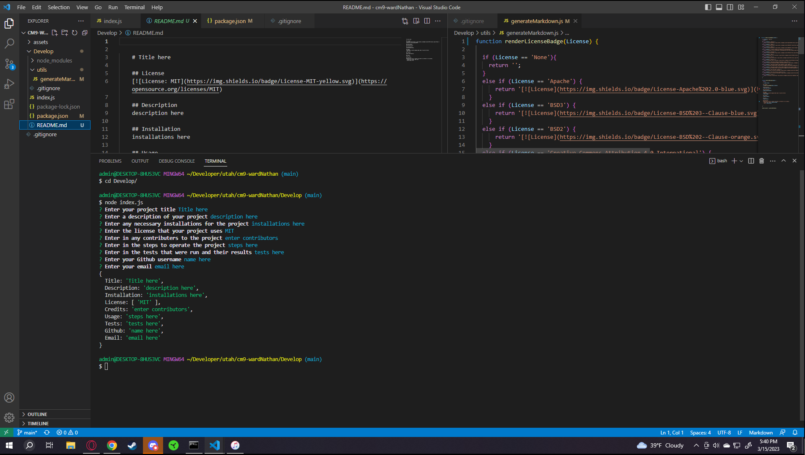

# README generator

## License

## Description

I wanted an easy way to enter in README information that formats it for me
    
## Installation

Node and npm i inquirer@8.2.4 are required

## Usage

First complete installation, then pull up terminal and enter cd Develop, then enter in "node index.js", follow prompts
    
## Credits

N/A

## Tests

N/A
    
## Questions

Please feel free to contact me either on Github or at my email.
- Github user name- wardNathan
- Email-xuserx98@gmail.com
    
## Links and Images

https://github.com/wardNathan/cm9-wardNathan
https://drive.google.com/file/d/1qUH7a7WejipXxUDqOoB8qNweJK7M9Ui7/view
